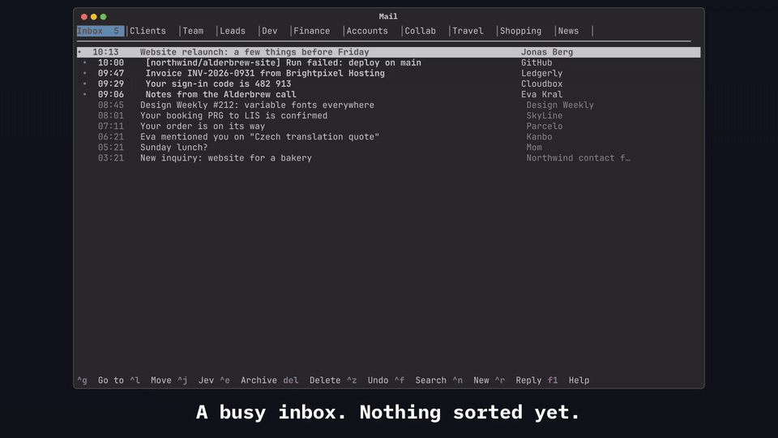
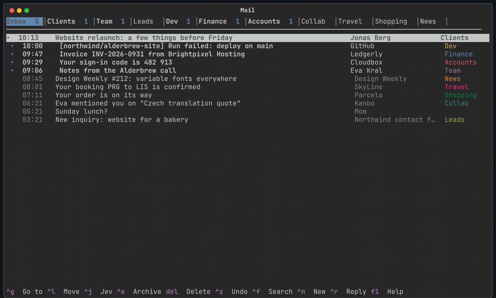
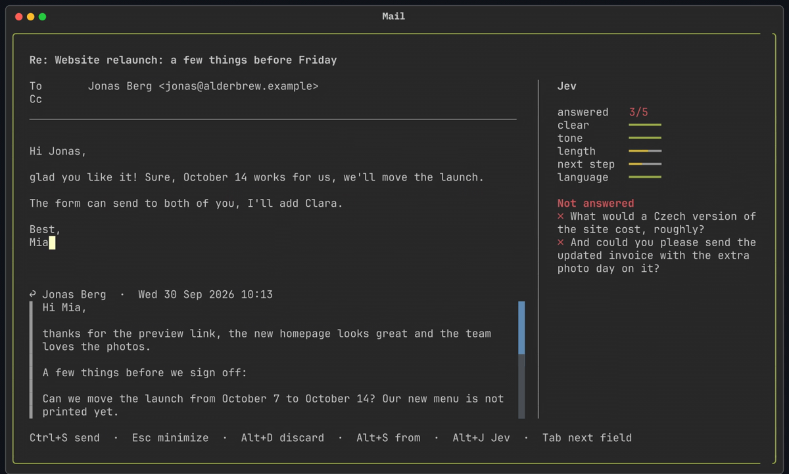

# Mail for Omarchy

A light terminal Gmail client for [Omarchy](https://omarchy.org). Arrow keys and Ctrl shortcuts
(no vim), categories that are Gmail labels (so they show up on your phone too), and **Jev**
(TypeSafe AI), which files your mail into them and reads your replies before you send them.



[Full-quality video (MP4)](assets/jev-demo.mp4)

## What Jev does

- **Sorts your inbox.** Every new message goes into the category it fits, as a Gmail label.
  Jev only acts when it's confident (`threshold`). Anything personal or unclear stays in the Inbox.
  `Ctrl+J` on any message shows how Jev weighed every category, and Enter moves it there.
- **Reads your reply while you write it.** A sidebar grades clarity, tone, length, next step and
  language as green / yellow / red bars. In a reply, it checks every question and request of the
  original message and lists the ones you haven't answered yet.

 

## Install on Omarchy

You need Omarchy with shell plugins (`omarchy plugin`) and [uv](https://docs.astral.sh/uv/)
(`sudo pacman -S uv`). Python and the dependencies are set up by uv on first run.

**1. Add the plugin.** This clones it into `~/.config/omarchy/plugins/petrzpav.mail` and puts
the unread-mail envelope in your bar:

```
omarchy plugin add https://github.com/petrzpav/omarchy-mail --enable
```

**2. Run the installer.** It puts `mail` and `mail-window` on your PATH, registers the client
for `mailto:` links, links the Jev auto-sort timer, and copies `examples/` to your config:

```
~/.config/omarchy/plugins/petrzpav.mail/install.sh
```

**3. Fill in your config** in `~/.config/petrzpav-mail/`:

```
config.toml       your Gmail address, the addresses you send from, Jev threshold, [keys]
categories.toml   your categories, each with the description Jev reads when sorting
secrets           GMAIL_APP_PASSWORD=…  TYPESAFE_API_KEY=…   (chmod 600)
```

Gmail signs in with an [app password](https://myaccount.google.com/apppasswords)
(needs 2-Step Verification on your Google account). Jev needs a TypeSafe AI API key.

**4. Go.** Click the envelope in the bar or run `mail-window`. To let Jev sort new mail every
five minutes:

```
systemctl --user enable --now mail-sort.timer
```

Update later with `omarchy plugin update petrzpav.mail`.

`install.sh` never replaces a file it didn't create: if you already have a `mail` command in
`~/.local/bin` or a `mail.desktop`, it skips it and says so. An existing config is never touched.

## Uninstall

```
~/.config/omarchy/plugins/petrzpav.mail/install.sh --remove
omarchy plugin remove petrzpav.mail
```

The first line stops the timer and removes the commands, the `mailto:` handler and the unit links
the installer made. Your config and cache stay; delete them too if you want everything gone:

```
rm -rf ~/.config/petrzpav-mail ~/.cache/petrzpav-mail ~/.local/state/petrzpav-mail
```

Your mail itself lives in Gmail: nothing is deleted there, and the labels stay as they are.

## Dependencies and privacy

- **uv**, which installs Python 3.12+ and Textual, httpx and html2text into
  `~/.local/share/petrzpav-mail/venv` on first run.
- **Gmail** over IMAP and SMTP (`imap.gmail.com`, `smtp.gmail.com`), signed in with your app
  password. Mail is cached locally in `~/.cache/petrzpav-mail`.
- **Jev** at `api.typesafe.ai`. To sort or review, the client sends Jev the message in question:
  sender, recipient, subject and the start of the body (and, for a review, your draft and the
  message you're replying to). Without `TYPESAFE_API_KEY` everything else works; Jev just says the key is missing.
- No telemetry, no sudo, no system services: the optional sort timer is a systemd *user* unit.

## Try the demo

Just want to see Jev work, without connecting Gmail? The demo runs the real client on a made-up
inbox. Only Jev is real, so it needs `TYPESAFE_API_KEY` (in your environment or secrets file):

```
~/.config/omarchy/plugins/petrzpav.mail/demo/mail-demo
```

Then try: `Ctrl+K` → "Sort inbox with Jev now", `Ctrl+J` on any message, and `Ctrl+R` on
Jonas's email to watch the review sidebar while you write. Nothing is sent anywhere.

`demo/mail-demo record` drives the same demo headless and renders the video above to
`demo/out/jev-demo.mp4` (needs `rsvg-convert`, ImageMagick and ffmpeg).

## Use

| | |
|---|---|
| `mail-window` | open the client in its own window (the bar widget does the same) |
| `mail` | the client in the current terminal (`F1` lists every shortcut, `Ctrl+K` searches all actions) |
| `mail compose [mailto:…]` | write a new message |
| `mail sort [--dry-run]` | let Jev file new inbox mail (only moves at ≥ threshold confidence) |
| `mail backfill [--days N]` | let Jev label older mail (adds labels only) |
| `mail cat ls\|add\|rm\|rename` | manage categories (creates/renames Gmail labels) |
| `mail unread` | inbox unread count |

Auto-sort: `systemctl --user enable --now mail-sort.timer`. Every decision is logged to
`~/.local/state/petrzpav-mail/sort.log`, and "Jev history" in the palette puts a message back.

## Reading

Mail is grouped into Gmail conversations. Opening one switches to a focus mode: one centered
column, the newest message open, older ones folded to a line (↑↓ move, Enter/Space open), quoted
history folded under "··· earlier messages". Archive, move and delete act on the whole conversation.
Tab walks the links and Enter opens one, or Ctrl+click it; Trello links open in the Trello client
if it's installed. Drag the mouse to select text, `Ctrl+C` copies it.

## Writing

Replies are sent from the address the message was sent to. In compose, `Alt+S` picks another
From address, and To and Cc suggest people from your mail as you type (↑↓, Enter or Tab to take one).
Drafts are saved as you type, locally and to Gmail's Drafts, so you can finish them on your phone.

Sending goes through Gmail SMTP, which only accepts From addresses verified as "Send mail as" in
Gmail settings. For any other address, give that identity `smtp = "host:port"` in config.toml and
put its password in secrets as `SMTP_PASSWORD_<ADDRESS_IN_CAPS_WITH_UNDERSCORES>`.

Jev's review refreshes whenever you stop typing for a few seconds (`review_auto = false` under
`[jev]` turns that off) and on `Alt+J`. Your own criteria can replace the defaults: `[[review]]`
entries with `name`, `question`, `good`, `ok`, `poor` (and `reply_only = true`).

## Scripting and Claude Code

Everything the client does also works from the shell, so scripts and AI agents can read and answer
mail without the TUI: `mail folders`, `ls [FOLDER] [--unread]`, `search 'GMAIL QUERY'`, `show ID`,
`attachments ID`, `archive|trash|move|label|mark-read|star … ID…`, `undo`, and
`draft --reply|--reply-all|--forward ID` → `drafts --show` → `send` (a draft also lands in Gmail
Drafts, so you can finish it on the phone). Lists take `--json`; see `mail -h`.

To let Claude Code use these commands, run `install.sh --skill`: it links `skill/` into
`~/.claude/skills/mail`, so Claude knows them in every project (and drafts first, sending only
when you say so). Plain `install.sh` leaves `~/.claude` alone; `--remove` takes the link back.

## License

MIT
